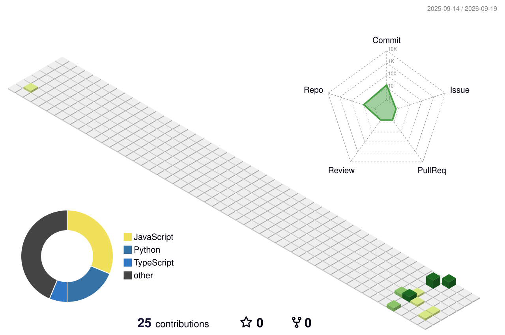

<div align="center">

<!-- ========================================================= -->
<!--                    CYBERPUNK HEADER                        -->
<!-- ========================================================= -->


<br>


<br><br>

<!-- ========================================================= -->
<!--                    PROFILE METRICS                        -->
<!-- ========================================================= -->


&nbsp;&nbsp;


&nbsp;&nbsp;


</div>

---

# `> SYSTEM.IDENTITY`

```text
┌──────────────────────────────────────────────────────────────┐
│                                                              │
│   USER        : VEERESH S                                    │
│   ROLE        : AIML ENGINEER IN PROGRESS                    │
│   DOMAIN      : ARTIFICIAL INTELLIGENCE & MACHINE LEARNING   │
│   SPECIALITY  : PYTHON • AI • ML • COMPUTER VISION          │
│   STATUS      : FINAL-YEAR ENGINEERING STUDENT               │
│   MODE        : BUILD • LEARN • EXPERIMENT • DEPLOY          │
│                                                              │
└──────────────────────────────────────────────────────────────┘
---

# `> 3D.CONTRIBUTION.MATRIX`

<div align="center">



</div>

---
